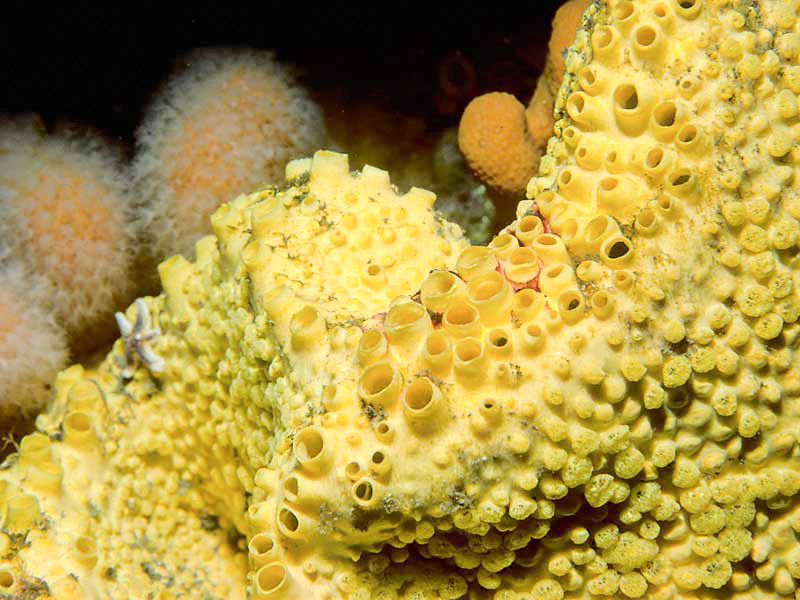

```{r setup, include=FALSE}
knitr::opts_chunk$set(echo = TRUE)
```

# Week 6: PCA 


The lecture for this week focused on **Plotting a PCA** can be found [here](https://github.com/BayLab/MarineGenomics/blob/main/ppt/Week6_lecture.pdf).

In week 3 we mapped reads to a genome so we could call our genetic variants (SNPs) and generated bam files for each read file (= sequence data from an individual). Now that we know how to do some R basics we can use those SNPs to plot patterns of population structure via a principal component analysis. 

The first portion of this lesson will be performed in **bash** and then we will generate the plots in **RStudio**.

## Download the data

We first need to download the data. Use the link below to download it to jetstream, and then us the tar command to un-compress it.


```html

wget https://raw.githubusercontent.com/BayLab/MarineGenomicsData/main/week6.tar.gz

tar -xzvf week6.tar.gz

```

Our data this week consists of genotype_likelihood files in beagle format and a bam.filelist which contains id information for our samples. 

```html

ls -lh MarineGenomicsData/Week6

```

## Installing programs

We will also need to install a few programs. The code below installs the program pcangsd, and a few dependencies for pcangsd:

```html

#install pip for python
curl https://bootstrap.pypa.io/get-pip.py -o get-pip.py
python3 get-pip.py

#we need to add our home directory to the path for pip
#look at path
echo $PATH

#add the location of pip to our path
export PATH="$HOME/.local/bin:$PATH"


#then install pcangsd
git clone https://github.com/Rosemeis/pcangsd.git
cd pcangsd/
python3 setup.py build_ext --inplace


#and then use pip to install the other requirements needed for pcangsd (note you must be in the pcangsd directory for this to work)
pip install --user -r requirements.txt

```


Check that it's installed correctly.
```html
#navigate to your home directory
cd

python3 pcangsd/pcangsd.py -h
```


You should see the help menu for pcangsd. 

## Run pcangsd on our data

```html

python3 ../../pcangsd/pcangsd.py -beagle genolike_beagle.beagle.gz -o pca_out -threads 28

```


This will generate a covariance matrix output file. We can read this file into R and compute the eigenvectors and eigenvalues and make our plot. 

## Setting up a new project in R

We'll first open a new `.R` script to keep track of our code and everything that we're doing. Be sure to comment heavily with `#`. It may seem obvious what we're doing now, but you will forget what certain lines of code do in a surprisingly short amount of time. 


## Reading data into R

There are several ways to read data in R. Useful functions include `read.table()`, `getwd()`, and `setwd()`

R like many other programs is set to start in a specific direcotory, usually the desktop or homw directory. You can check and see what directory R is set in with the command `getwd()`

And of course all of this code is typed into our script and commented along the way.

```{r, echo=T}

#check working directory
#getwd()

#should output

#[1] "/home/margeno"

```


Thus in jetstream the working directory is set to our home directory, which will work fine for uploading data. If you need to change the directory you can use `setwd()` and provide it with the full directory path (e.g., "C:\Users\Serena\Documents\MarineGenomics\") and then confirm that it moved the directory with `getwd()`. 

In Rstudio you can also use the pull down menus `Session` to get and set your working directory. Similarly, the tab `Files` in the lower right will also allow you to set your working directory.


Now well read the data output by angsd into R using `read.table()` and `as.matrix()`

```{r, echo=T}

#cov<-as.matrix(read.table("MarineGenomicsData/Week6/pca_out.cov"))

```


And then we can compute the eigenvalues from our covariance matrix with the function `eigen`.


```{r, echo=T}

#e<-eigen(cov)

```

And make a simple plot in base R


```{r, echo=T}


#plot(e$vectors[,1:2])

```
We may be interested in how much of the variance our first two components explain. You can look at this in the `e` object under values. We divide the eigen values by the sum of all the values to get the percent explained by each value.

```{r, echo=T}

#e$values/sum(e$values)


```


We now want to make the colors match population labels. The information for which population each individual sample came from is in the bam.filelist file.


```{r, echo=T}

#read in the data

#names<-read.table("MarineGenomicsData/Week6/bam.filelist")

#assign the rownames of the covariance matix the 

#rownames(cov)<-names$V2

#remake the plot with the colors we want

#plot(e$vectors[,1:2], col=as.factor(rownames(cov)), pch=16)

```

There is another column in the bam.filelist file that will allow us to color the populations based on region. Go ahead and modify your plots to have nice x and y labels that state the percent variance explained by each axis, and that are colored by region. You can also change the pch and any other parameters you would like.


## Exercises
> # Practice Questions

> 01. In R, upload the genotype likelihood file. Filter the data so that we only use sites for which all 15 individuals have data present (i.e., subsite by the nInd column). How many SNPs does this leave us? 
Hint use the command `read.table(gzfile("path/to/genotypelikelihoodfile/), header=T)` to read in the file in R. Dont forget to assign it to an object or R will print the whole thing to the screen.

<details><summary><span style="color: goldenrod;">Solution</span></summary>
<p>

```{r, echo=T}
# coming soon!
```
</p>
</details>

>02. Use the filtered file from 01 in pcangsd to recalculate the covarianve matrix and regenerate the pca plot. HOw does it differ from the one we generated in class?

<details><summary><span style="color: goldenrod;">Solution</span></summary>
<p>

```{r, echo=T}
# coming soon!
```
</p>
</details>

## Creature of the Week!

